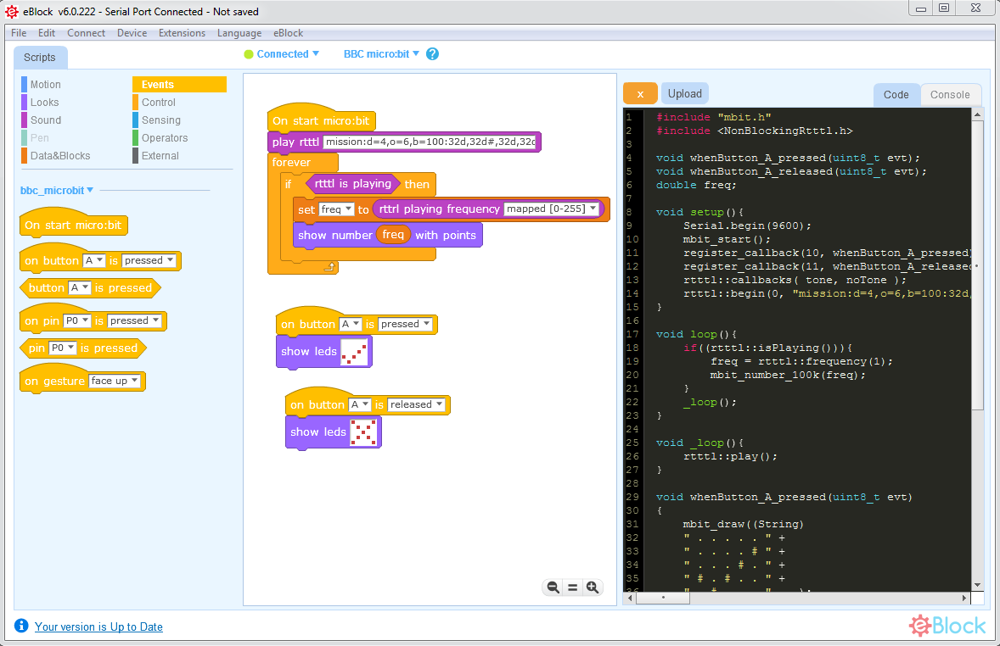

BBC micro:bit library for Arduino to use with [eBlock Scratch based App](https://github.com/distintiva/eBlock)

**You can use with Arduino IDE, and arduino-cli too**





### Sample code

```c
#include "mbit.h"
#include <NonBlockingRtttl.h>

void whenButton_A_pressed(uint8_t evt);
void whenButton_A_released(uint8_t evt);
double freq;

void setup(){
    Serial.begin(9600);
    mbit_start();
    register_callback(10, whenButton_A_pressed);
    register_callback(11, whenButton_A_released);
    rtttl::callbacks( tone, noTone );
    rtttl::begin(0, "mission:d=4,o=6,b=100:32d,32d#,32d,32d#,32d,32d#,32d,32d#,32d,32d,32d#,32e,32f,32f#,32g,16g,8p,16g,8p,16a#,16p,16c7,16p,16g,8p,16g,8p,16f,16p,16f#,16p,16g,8p,16g,8p,16a#,16p,16c7,16p,16g,8p,16g,8p,16f,16p,16f#,16p,16a#,16g,2d,32p,16a#,16g,2c#,32p,16a#,16g,2c,16p,16a#5,16c");
}

void loop(){
    if((rtttl::isPlaying())){
        freq = rtttl::frequency(1);
        mbit_number_100k(freq);
    }
    _loop();
}

void _loop(){
    rtttl::play();
}

void whenButton_A_pressed(uint8_t evt)
{
    mbit_draw((String)
    " . . . . . " +
    " . . . . # " +
    " . . . # . " +
    " # . # . . " +
    " . # . . . "    );
}

void whenButton_A_released(uint8_t evt)
{
    mbit_draw((String)
    " # . . . # " +
    " . # . # . " +
    " . . # . . " +
    " . # . # . " +
    " # . . . # "    );
}

void register_callback( uint8_t event,   void (*in_main_func)(uint8_t)  ){
         mbit_on( event, in_main_func );
}

void _delay(float seconds){
    long endTime = millis() + seconds * 1000;
    while(millis() < endTime)_loop();
}
```
